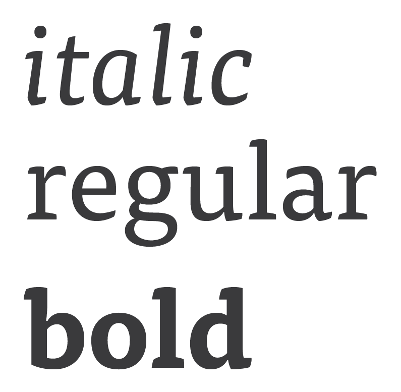
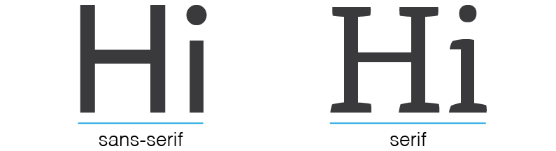
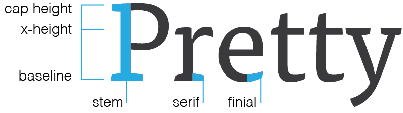

### Goals

In this lesson we'll talk about:

* the different between typeface and font
* the different between serif and sans serif
* font size and letter spacing
* the structure of letterforms
* a set of strategies to apply when looking for font pairings

### What is Typography

Typography is a cornerstone of graphic design. The way we arrange letters and words on a screen is a huge part of how we communicate with users. Design is all about people and communication, and the words we choose and how we arrange them are arguably even more important then the images and colors we use. When done well, it makes reading easier. When done _really_ well, our users don't even notice it.

The font choices you make have very real implications on how your user interprets and understands the content. For example: would you really take someone seriously if they set their resume in Papyrus, even if they had solid work experience? At the very least, it would make you question their judgement and their professionalism. At worst, you might pass on them completely because it would be difficult to consider them a serious candidate.

### Font vs Typeface

You've probably heard these two terms tossed around and used interchangeably, but they're actually two different things. A font is not a typeface and a typeface is not a font. Knowing the difference is the first step in understanding typography, so let's talk about what that is:

##### Typeface

A typeface is a collection of fonts. It is made up of the grouping of various italic, bold, thin weights that a type designer has recreated to give variation to their work.

You select a typeface and then use the fonts within it.

For example, the typeface Helvetica has Light, Bold, and Oblique fonts. You might you a bold font for headers, a light font for body copy, and an oblique (or italic) font for pull quotes.

##### Font

A font is each specific variation within a typeface. So, when we go to Google Fonts we choose a typeface like [Raleway](https://fonts.google.com/specimen/Raleway) and then select which fonts we actually want our page to load. In the context of printed text, fonts are what is actually used to print the text.

### Serif vs Sans Serif

There are two primary classifications of typefaces: serif and sans serif. A serif is, basically, a small line added at the end of a stroke in a letter. Sans serif is simply a letterform without a serif.

It is commonly thought that serifs increase legibility in dense, printed blocks of text because the serifs lead the eye from letter to letter within words.

Sans serif fonts are generally considered easier to read in large blocks of text on screens.

### Font Size and Line Height

When assessing what the most appropriate font size is for your content, it is typically best to start with your body text. We do this because body text generally is set in dense blocks of copy which means it has the potential to be the most difficult content on the page to read.

First make sure that the point size is large enough. On screens, somewhere in the range of 14-24px is easiest to read.

Next, make sure your line spacing is appropriate and enhances the legibility of your content rather than detract from it. Line spacing, or "leading" in traditional print media, should be somewhere between 120% and 145% of the font size. This assures that your lines of text have room to breathe.

And remember: every typeface is different. Just because 14px might be easily legible in a sturdy sans-serif, doesn't mean that 14px will be large enough in a more delicate serif. When trying out a new typeface, play around with font size and letter spacing to make sure it's easy to read.

### Anatomy of a Letterform

Perhaps unsurprisingly, there are many typographic terms that come in handy when discussing letters in any amount of detail. Let's go over a few key terms that can help you speak type.

##### Cap Height
The height of a capital letter measured from the baseline.

##### X-height
The height of lowercase letters from the baseline, typically based on the height of the lowercase "x". X-height does not include ascenders or descenders, and it is measured against the main body of the lowercase letter.

##### Baseline
The line that all characters sit on, and the point from which x-height and cap height are measured.

##### Stem
The main, full length vertical stroke in most characters.

##### Serif
The extra stroke at the beginning and end of vertical and horizontal strokes of letterforms.

##### Finial
A tapered end of a letter, as seen on letters like "c" and "e".

##### Ligature
When two or more characters are joined to form one character. Ligatures can represent specific sounds but are often simply used to create more appealing and legible text.

##### Counter
The open space in a fully closed, or mostly close, letter, like "o" and "c". Some will say a counter only refers to a closed space, and refer to the the partially closed space in a "c" as an open counter.

##### Bowl
The fully closed, rounded part of a letter.

##### Ascender
The upward vertical stroke on a lowercase letter that extends upwards above the letter's x-height. Lowercase "b" and "h" are examples of letters with ascenders.

##### Descender
The downward vertical stroke and falls below the baseline. Lowercase "g" and "p" are examples of letters with descenders.

### How to Make Good Font Pairings

Now that you've got some vocabulary in your design toolkit, let's talk about font pairs.

First thing's first: You can accomplish a lot with font in 2-3 weights. You don't have to dive straight in to mixing fonts! After all, it's hard enough to find one font that looks nice, so how in the world are we supposed to find two?

Well, if you follow a few guidelines you can take some of the guesswork out of font pairings. It turns out you can apply many of the same principles that help guide you in choosing one well constructed, quality font when you're looking for two that pair nicely.

### Form and Structure

The structure of the individual letterforms and how they work together is a key part of assessing prospective typefaces. We're looking at how the parts coming together to form an individual letter are approached, and how those letterforms come together to create the font.

When assessing suitability for pairing, looking for similarity in shape and form can be a great place to get started.

As a typography newbie, you'll likely have an easier time finding solid font pairs using the concept of similarity to guide your hunt, and as you begin to feel more confident in your familiarity with typography, you can make more adventurous pairings.

#### Assessing Similarity

When finding a font pairing with similar characteristics, we look for different typefaces (perhaps a sans-serif and a serif) that have similar approaches to the structure of the letters and how those letters combine to form words. Here are some of the key things that contribute to different typefaces feeling cohesive rather than two separate entities:

* **Cap height:** We want our font pairings to be roughly the same height so they feel visually balanced. Think of it this way: you could overlay a capital letter set in both fonts and it would take up just about the same amount of space.

* **X-height:** The height of lower case letters can have a huge impact in legibility -- generally, a taller x-height is going to be more legible at small sizes and on screens (for both serif and sans-serif). We want to look for fonts that have a very close x-heights, because it makes it easy for the reader to transition from one to another smoothly.

* **Letter spacing:** Part of a type designer's job is to carefully consider how their typefaces behave in blocks of written text. They take great care crafting individual letterforms, and then they redouble their efforts while deciding how those individual letters fit together as a whole. Well made typefaces have consistent spacing that allows for easy reading and give a sense of rhythm and cadence to your copy. While these spacing choices can be manually adjusted by the typesetter (i.e. you, the developer), if you choose a font with poor, inconsistent spacing, you'll spend far more time making adjustments to compensate for poor type design.

* **Apertures:** Apertures are the openings found in letters like _c_, _a_, and _e_. Open, airy apertures are highly legible and help readers quickly absorb content. Closed apertures are typically less legible, but may be more symmetrical. While we typically favor legibility, a high quality font with closed apertures can absolutely be used with great success, just be aware that it could have an impact on ease of reading and make layout and font sizing choices appropriately. Look for similar openings in both your typefaces.

* **Letter Width** Like letter spacing, different fonts that have letters of similar widths will feel more closely related than ones that don't. For example, having a very narrow condensed font paired with a very wide font is likely to feel a bit awkward.

* **Styles and Weight** Look for font families that include a true bold and italic versions. You want options, so a good rule of thumb is to look for typefaces with at least 4 styles (usually regular, italic, bold, and bold italic). One of the most common and most terrible crimes against typography is to add a faux italic or bold. A true italic font has been specifically developed by the designer, where as a faux italic is physically stretching and warping the letterforms, losing the integrity and spirit of the font. Don't be a type criminal, just use better fonts.

### Homework reading

* [A Pocket Guide to Master
Every Day’s Typographic Adventures](http://www.typogui.de/)

* These two (short!) chapters from [Professional Web Typography](https://prowebtype.com/)

  - [Choosing Headings](https://prowebtype.com/choosing-headings/)

  - [Selecting Body Text](https://prowebtype.com/selecting-body-text/)

### Additional Helpful Resources

* [Towards Combining Fonts](http://school.readymag.com/fonts/)

* [Typography is Impossible](https://medium.engineering/typography-is-impossible-5872b0c7f891#.6ms4yhl26)

* [Font Pair](http://fontpair.co/)
